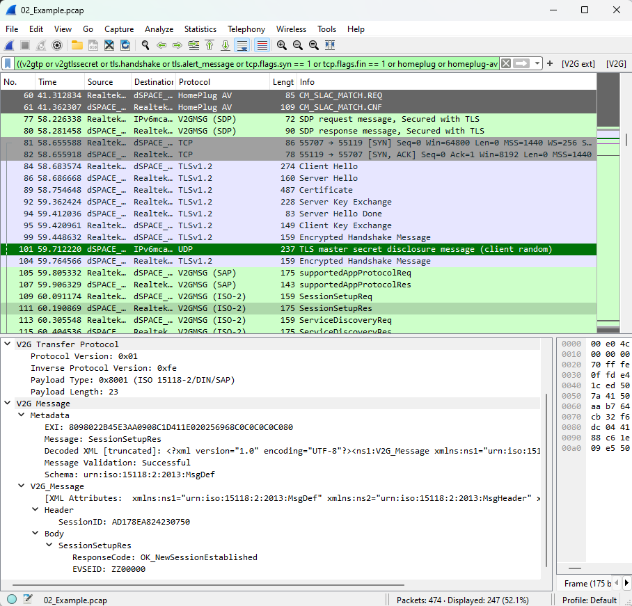
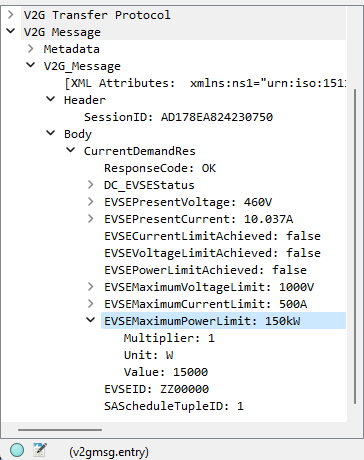
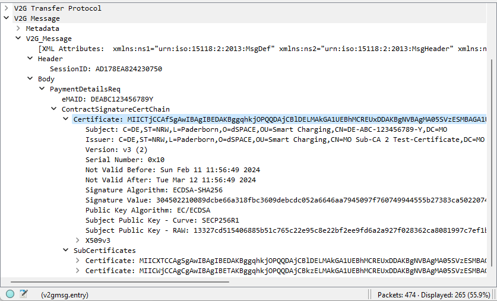
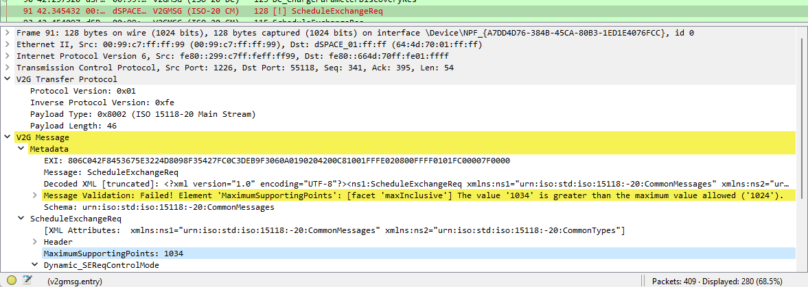
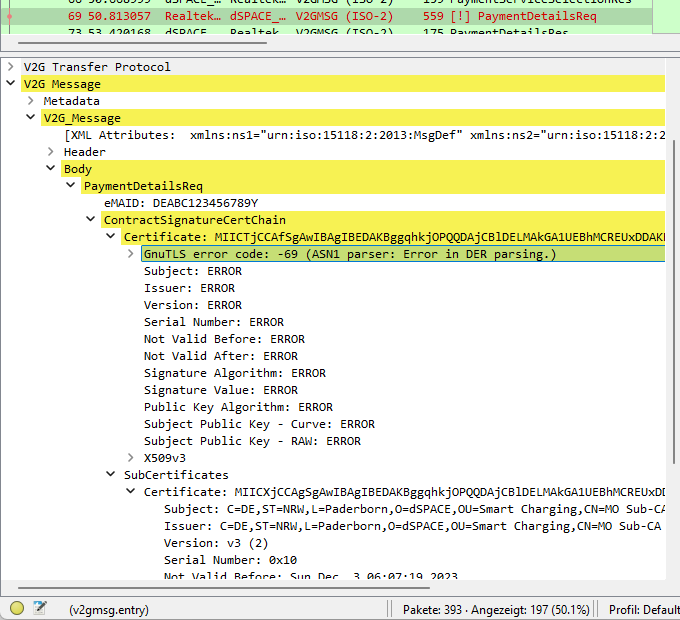
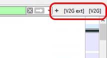
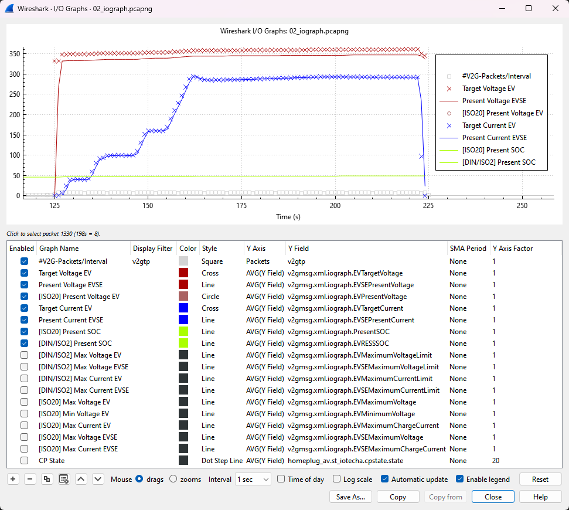
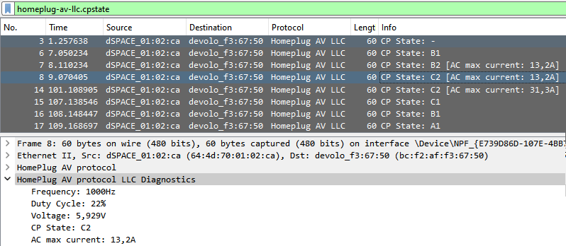
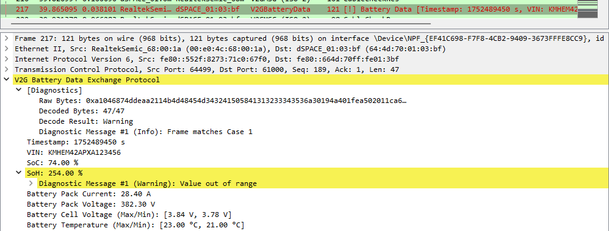

# dSPACE V2Gshark Wireshark Plugin
[](https://github.com/dspace-group/dsV2Gshark/releases)
[](https://www.dspace.com/)

> [!IMPORTANT]
**Wireshark 4.4+ requires dsV2Gshark 1.4.2 or higher**

## Overview
This Wireshark plugin allows to analyze and decode packets between electric vehicles (EV) and charging stations (EVSE), also known as V2G messages.  



## Features

### Overview
- Supports decoding of:
    - V2GTP layer (Vehicle to Grid Transport Protocol)
    - SAP messages (Supported App Protocol)
    - SDP messages (SECC Discovery Protocol)
    - DIN 70121  messages
    - ISO 15118-2 messages
    - ISO 15118-20 messages (preliminary support)
    - Battery Data Exchange messages (VAS Korea)
- Additional analysis features:
    - Validation of V2G messages according to XSD specification
    - Certificate information details for Plug & Charge (PnC)
    - Live TLS decryption <small>(requires secret disclosure)</small>
    - Extended charging diagnostics via HomePlug AV packets for sniffer and debug packets
        - support of dSPACE SCS diagnostic packets
    - Validation of Battery Data Exchange Protocol data format
- Automatic schema detection
    - Detect schema automatically in case of missing SDP or SAP
- Color filter for V2G packets
- Filter buttons for V2G packets
- Wireshark I/O Graph support for V2G packets

### Live TLS Decryption
> [!IMPORTANT]
To decrypt a TLS session, you need a compatible device (like the dSPACE DS5366) that is capable of disclosing the TLS secret during or after the handshake. Please note that this feature is not available on productive devices. It is not possible to decrypt regular TLS sessions.  
If a session with a disclosed TLS secret was recorded without dsV2Gshark being installed, you can still decrypt the data by installing dsV2Gshark afterwards.

The plugin processes a TLS master secret disclosure packet after handshake to decode the following V2G session.  
The disclosure message is a UDP packet within the source port range 49152-65535 containing the ASCII string `CLIENT_RANDOM <32-byte client random> <48-byte master secret>` as payload data (TLS 1.2). This disclosure message has to be sent from one of the communication partners in a testing environment.  
For TLS 1.3 decryption you have to provide different secrets: `CLIENT_HANDSHAKE_TRAFFIC_SECRET`, `SERVER_HANDSHAKE_TRAFFIC_SECRET`, `EXPORTER_SECRET`, `CLIENT_TRAFFIC_SECRET_<number>`, `SERVER_TRAFFIC_SECRET_<number>`. You can send one UDP packet for each secret or combine the secrets in one UDP packet (separated by line breaks).  
> [!NOTE]
In order to autodecrypt charging sessions using non-GUI versions of Wireshark (e.g. tshark), the full PCAP must be parsed twice. This is because there is no matching redissection trigger available in the Wireshark API.

### Wireshark I/O Graph
This optional feature updates the Wireshark I/O Graph preferences to display a V2G session. The graph can be accessed via 'Statistics' -> 'I/O Graphs' (shortcut: Alt + S + I).  
The graph displays the data in 1 second intervals. This can be changed using the drop down menu at the bottom.  
To simplify the visualisation, some V2G related signals (e.g., MaxVoltage) are disabled by default. They can be enabled using the check boxes in the selection view.  
Click on a packet in the graph to inspect it in the Wireshark main window. Press the SPACE key to activate a helper line on the graph if you need more precision.

## Requirements
- Wireshark (64 bit) 3.5.0 or higher
- Operating Sytems:
    - Windows 7 or higher
    - Linux x64 (see [Limitations](#limitations))
    - macOS (tested on Apple Silicon and macOS Sequoia 15.6)

## Installation notes
- The installer can be downloaded from [GitHub Releases](https://github.com/dspace-group/dsV2Gshark/releases/latest). The setup is signed by "dSPACE GmbH".
- To use the plugin without installer, download the zipped files from [GitHub Releases](https://github.com/dspace-group/dsV2Gshark/releases/latest) and copy its content manually into your Wireshark installation or into your personal plugin directory (Windows: %appdata%/wireshark/, Linux: ~/.local/lib/wireshark/). To activate the filter buttons, color filter and I/O Graph in this case, you have to import and activate the dsV2Gshark_profile.zip as Wireshark profile.
- If Wireshark auto-update is enabled, it is recommended to install the plugin in local install mode without admin privileges.
- Not compatible with other V2G dissector plugins. Please uninstall these plugins before installing dsV2Gshark.
- Not compatible with 32 bit versions of Wireshark.
- Updates of the plugin can be performed directly without uninstalling the old version.
- Installation size is about 13 MB
- Supports normal and portable version of Wireshark
- Optionally, a Wireshark Profile will be added which handles the filter buttons, color filters and I/O Graph. This profile is automatically activated after installation. You can change the current profile in the bottom right corner (shortcut: Ctrl + Shift + A).

### macOS

You need to have gnutls installed via brew for the plugin to compile:

```brew install gnutls```

Build the v2g library by running `V2G_Libraries/v2gLib/build_macos.sh`, then copy:
- `V2G_Libraries/v2gLib/bin/v2gLib.so` to `~/.local/lib/wireshark`
- `Wireshark/plugins/*` to `~/.local/lib/wireshark/plugins`


## Limitations
- ISO 15118-20 is not fully supported yet
    - please let us know if you encounter incorrectly decoded packets
- Linux
    - No installer, see [Installation Notes](#installation-notes). Make sure you have read permissions for all files.
    - dsV2Gshark profile (Filter buttons, color filters, I/O graph) must be added manually
    - released libraries have been built with Ubuntu 22.04

## Support
- If you encounter any problems, feel free to open an issue or contact us at support@dSPACE.de
- We appreciate all contributions, from reporting bugs to implementing new features

## Further notes
- This plugin was built with Wireshark 4.4.5 and 4.2.6
- The EXI decoding is based on [cbExiGen](https://github.com/EVerest/cbexigen)

## Troubleshooting
- When sniffing V2G communication, lost packets may occur, which cause corrupted TCP/TLS sessions. In that case, it may help to activate the option to ignore Message Authentication Code (MAC) check failures in the Wireshark TLS protocol settings.  
    This option can be found under Wireshark Preferences - Protocols - TLS


## Screenshots
### Message Inspection

### Certificate Details

### Message Validation

### Certificate Check

### Live TLS Decryption

### Filter Buttons

### Wireshark I/O Graph

### HomePlug AV Low-Level Communication Sniffer Dissection

### Battery Data Exchange Dissection and Validation


